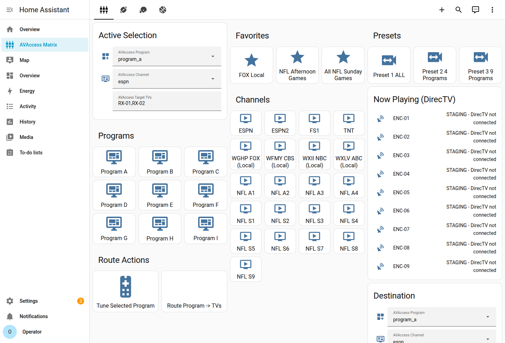
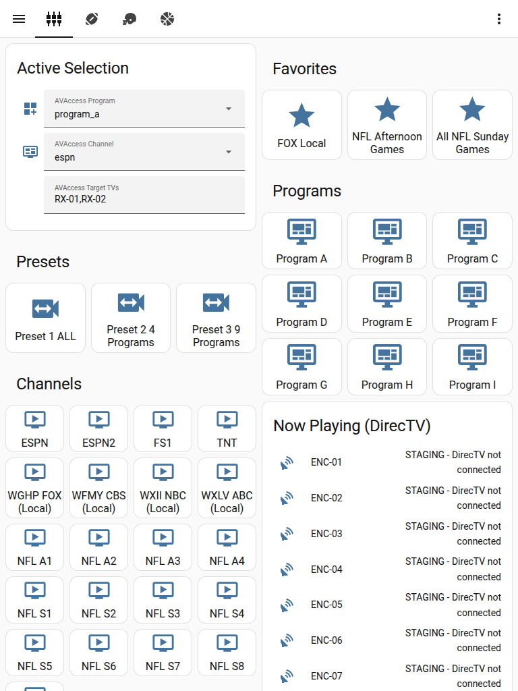
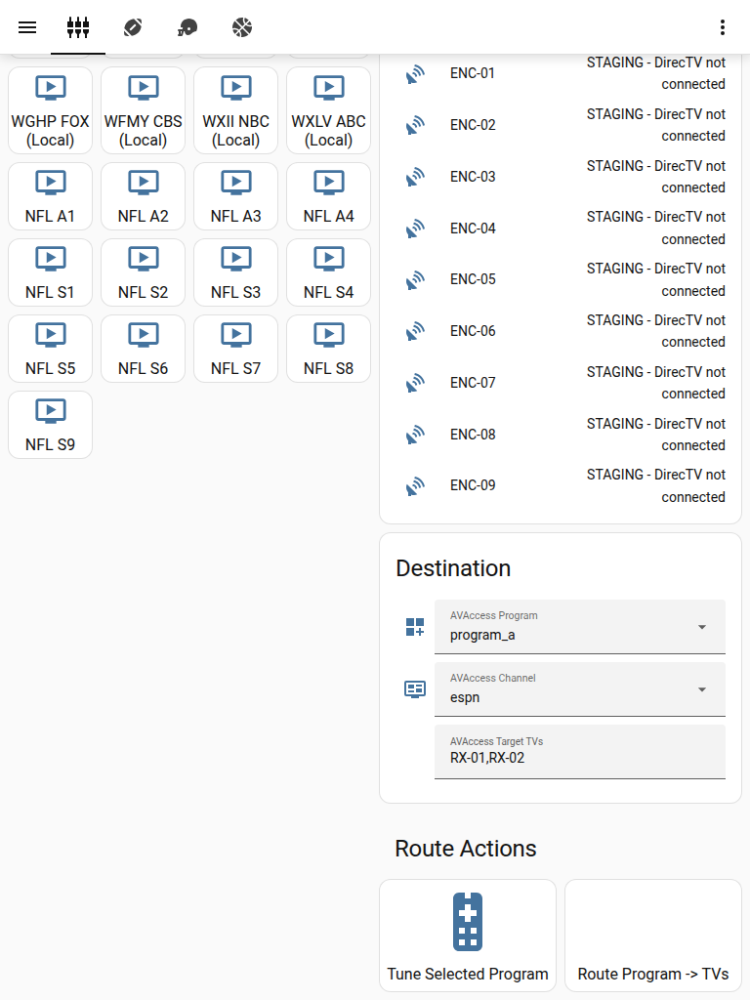
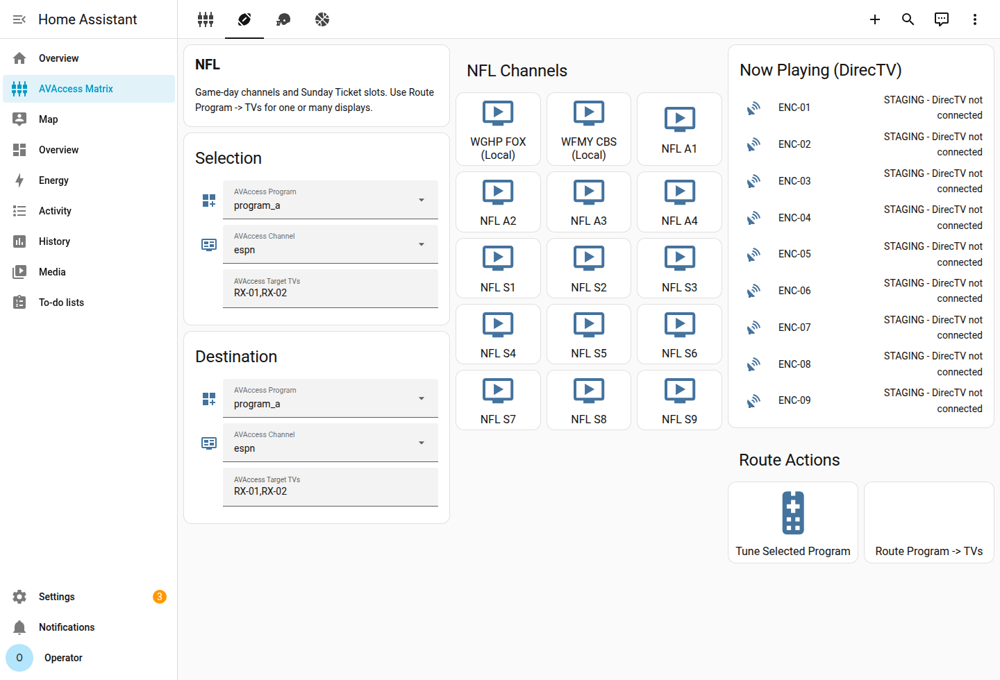
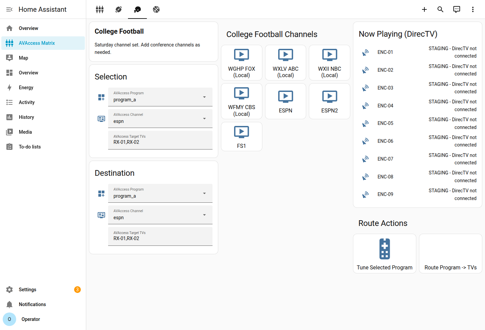
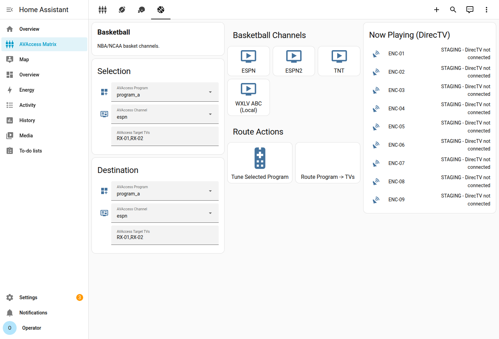
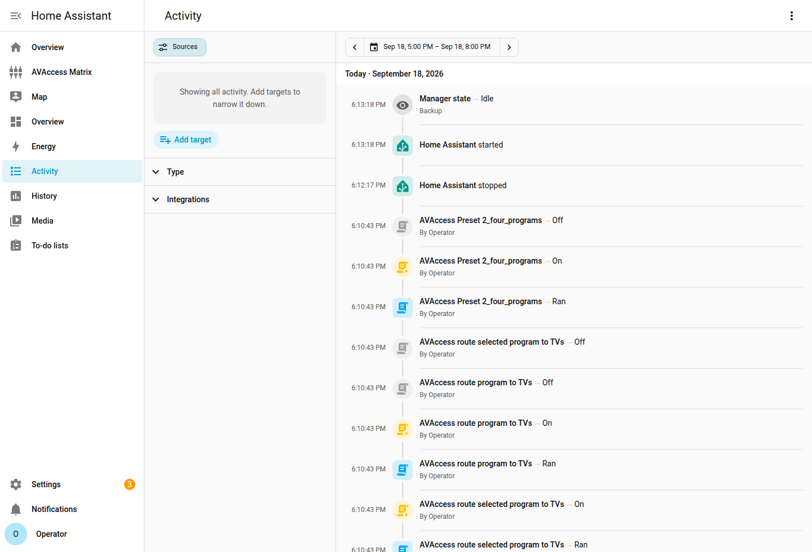

# AVAccess iPad operations guide

This is the day-of-game playbook for the **AVAccess Matrix** dashboard in Home Assistant. It drives **10 DirecTV H25 boxes** (through 10 AVAccess encoders) onto **35 TVs**.

These pictures are from the live cloud staging instance (HA 2026.9). Taps run for real — scripts fire and show up in Activity. Hardware is stubbed in staging, so **Now Playing** reads `STAGING - DirecTV not connected` instead of the live program title. On the site HA, those cards show the actual H25 channel.

## Open the dashboard

1. On the iPad, open **Home Assistant Companion** (or Safari) and sign in.
2. In the sidebar, tap **AVAccess Matrix**.
3. The four tabs across the top are **Control**, **NFL**, **College Football**, and **Basketball**.

Desktop Control tab (favorites, presets, programs, channels, Now Playing, route):

iPad portrait — this is the operator view:

## What the words mean

| You tap | What it is |
|---------|------------|
| **Program A…I** | One DirecTV box. A = ENC-01 / H25-01, B = ENC-02 / H25-02, … I = ENC-09 / H25-09. ENC-10 is spare. |
| **Preset 1 / 2 / 3** | Which TVs watch which program (the AVAccess matrix). |
| **Channel buttons** | Tune the selected program’s H25 to that channel (FOX, ESPN, NFL S1, …). |
| **Favorites** | Preset + the matching tunes in one tap. |
| **AVAccess Target TVs** | Receiver IDs for ad-hoc routing, like `RX-01,RX-02`. |
| **Now Playing** | What each H25 is on. Staging shows the stub string; production shows the live title. |

## One-tap favorites (use these first)

Tap a star on the Control tab. Wait a couple of seconds while the preset lands, then the H25s change channel.

| Button | Matrix | H25 tunes |
|--------|--------|-----------|
| **FOX Local** | Preset 1 — all 35 TVs on Program A | Program A → local FOX (WGHP) |
| **NFL Afternoon Games** | Preset 2 — four groups (9 / 9 / 9 / 8 TVs) | Programs A–D → NFL A1–A4 |
| **All NFL Sunday Games** | Preset 3 — nine groups (4×8 TVs + 3) | Programs A–I → NFL S1–S9 |

Sunday Ticket vs local blackout (ZIP 27403) is handled when the weekly schedule runs: if the same game is on WGHP **and** a Ticket channel, the slot stays on the **local** channel number.

## Presets only (layout, no channel change)

Use these when the H25s are already on the right games and you only need to split or unsplit the wall.

| Button | Layout |
|--------|--------|
| **Preset 1 ALL** | Every TV shows Program A |
| **Preset 2 4 Programs** | ENC-01…04 → 9 / 9 / 9 / 8 TVs |
| **Preset 3 9 Programs** | ENC-01…09 → eight groups of 4 TVs and one group of 3 |

## Manual: pick a program, then a channel

1. Tap **Program A** (or B…I) — that is the H25 you are about to change.
2. Tap a channel (**ESPN**, **WGHP FOX (Local)**, **NFL S3**, …).
3. Or set **AVAccess Channel** in Active Selection and tap **Tune Selected Program**.

**Active Selection** (top left) always shows the current program, channel, and target TVs.

## Send one program to specific TVs

Scroll the iPad Control tab to **Destination** and **Route Actions**:

1. Tap the **program** you want on those TVs (A…I).
2. Put receiver IDs in **AVAccess Target TVs**, comma-separated: `RX-01,RX-02` or `RX-01,RX-04,RX-18`.
3. Tap **Route Program -> TVs**.

That does **not** retune the H25. It only tells the matrix “these TVs should watch this encoder.” Tune first if the box is on the wrong channel.

**Tune Selected Program** retunes the selected program’s H25 to the selected channel without changing which TVs are watching it.

## Sports pages

Same routing cards on every sport tab. Use these when you want a shorter channel list.

**NFL** — local FOX/CBS plus afternoon (A1–A4) and Sunday (S1–S9) slots:

**College Football** — locals + ESPN / ESPN2 / FS1:

**Basketball** — ESPN / ESPN2 / TNT / local ABC:

Typical sport-tab flow:

1. Tap the channel on the sport page (that selects and tunes the current program).
2. Confirm **Destination** program + target TVs.
3. Tap **Route Program -> TVs**, or use a **Favorite** if you want a whole-house preset instead.

## Proof the taps ran

Home Assistant **Activity** lists each script. After FOX Local, Route, and Preset 2, staging showed:

Look for **AVAccess Favorite FOX Local**, **AVAccess route selected program to TVs**, and **AVAccess Preset 2_four_programs**. Each should show **Ran** by the operator account.

On production, confirm the wall: TVs follow the preset, and Now Playing / the H25 OSD matches the channel you tapped.

## Game-day cheat sheet

**All TVs on local FOX**  
Control tab → **FOX Local**.

**Afternoon NFL package (four games)**  
Control tab → **NFL Afternoon Games**.  
Or NFL tab → tap A1…A4 onto programs A…D, then **Preset 2 4 Programs**.

**Every Sunday game (nine-way)**  
Control tab → **All NFL Sunday Games**.

**One overflow TV onto Program C**  
Set Target TVs to that receiver (example `RX-22`) → tap **Program C** → **Route Program -> TVs**.

**Wrong channel on one box**  
Tap that **Program** letter → tap the correct channel. Other TVs on that program follow, because they share the same H25.

## Staging vs the bar

| | This staging UI | Site / production HA |
|--|-----------------|----------------------|
| Dashboard | Same buttons and tabs | Same |
| Channel / preset / route taps | Scripts run; shell commands are `echo STAGING …` | UDP to the AVAccess switch + HTTP SHEF to each H25 |
| Now Playing | Dummy `sensor.directv_h25_*` | Official DirecTV `media_player` titles |
| Login (staging only) | `operator` / `avaccess-staging` | Your site owner account |

Do not point this staging container at live H25s or the AV switch. Generate the package **without** `--ui-staging` on the HA host that can reach the AV LAN.

## If something looks wrong

| Symptom | What to try |
|---------|-------------|
| TVs did not split | Tap the preset again. Confirm Activity shows the preset script **Ran**. |
| Right layout, wrong game | Tap the **Program** letter, then the channel (or the matching favorite). |
| One TV is on the wrong program | Route that RX to the program you want (`RX-##` in Target TVs). |
| Now Playing stuck on staging text | You are on the cloud UI stub. Use site HA after H25 External Access + Current Program are on. |
| Favorite did nothing | Open **Activity**. If the script is missing, reload scripts / restart HA after regenerating the bundle. |
| Sunday slot is Ticket instead of local | Re-run weekly sync (`docs/WEEKLY_SCHEDULE_SYNC.md`); ZIP 27403 prefers WGHP/WFMY/WXII/WXLV over 705–713 when both carry the same game. |

Installer setup (inventory, SHEF IPs, generating YAML) is in [HA_QUICKSTART.md](HA_QUICKSTART.md). Cutover tests are in [DIRECTV_H25_PATCH_AND_TEST_PLAN.md](DIRECTV_H25_PATCH_AND_TEST_PLAN.md).
